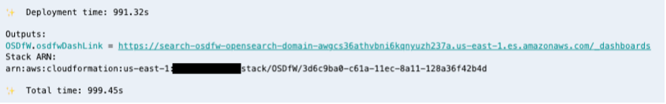
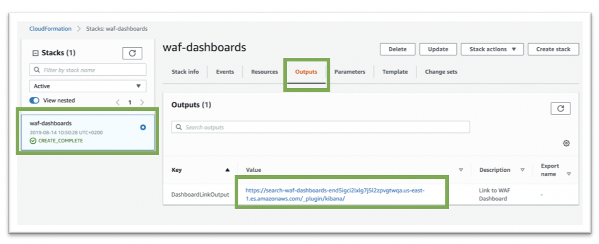
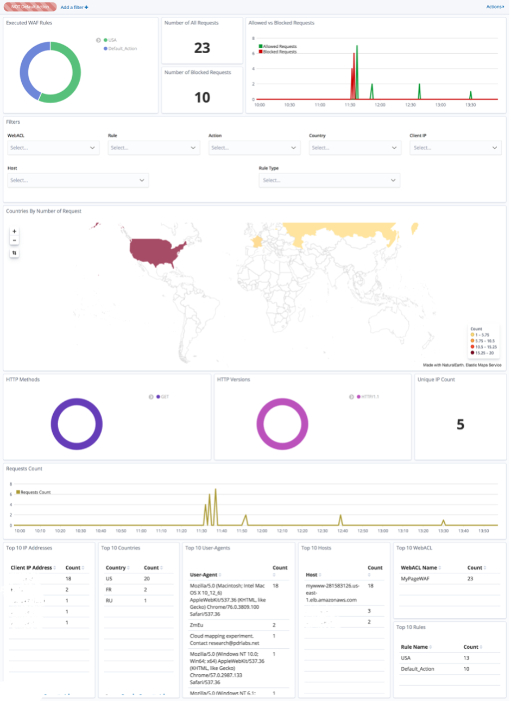
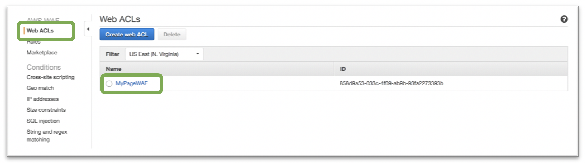
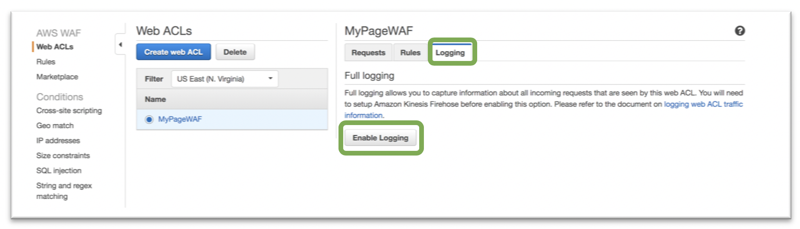
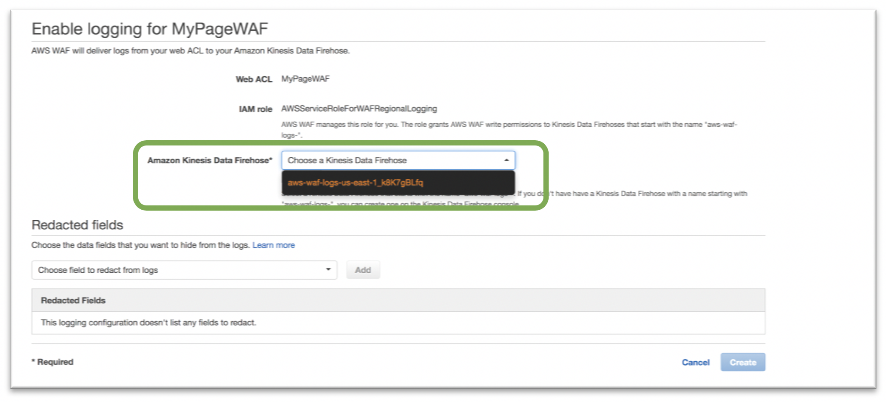
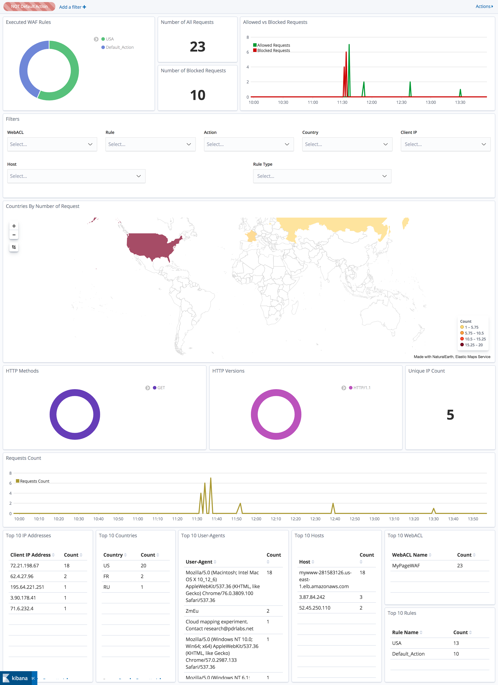

# AWS WAF Dashboard

## Description

AWS WAF Dashboards are ready to use dashboards (build on Amazon Elasticsearch Service with Kibana) which can be quickly connected to already existing AWS WAF configuration and allow visualization of AWS WAF Logs with multiple build in visualization diagrams.

To start using  AWS WAF Dashboards you don't need to have any prior experience with Elasticsarch or even AWS WAF, minimal AWS knowledge is require. You just need to launch a cloud formation template - which will do all the rest. Whole process takes around 30 minutes (with 25 minutes of waiting).

Important!
Solution is working for following regions: Tokyo, Seoul, Mumbai, Singapore, Sidney, Ireland, London, Paris, São Paulo, N. Virginia, Ohio, N. California, Oregon. The reason is that it depends on some others services (like Cognito) - which are not available in all regions.

## Installation

#### 1. Launch Cloud Formation template
Launch cloud formation templates. Use button below. By the default - you will be redirected to CloudFormation service in N. Virginia - if you want, you can change the region. This templatae will spinup multiple cloud resources, including: Elasticsearch cluster with Kibana for storing data and displaying dashboards, Cognito User Pool with registry of users who will have access to dashboards, Kinesis Firehose - for streaming logs to Elasticsearch and many others.

In the wizard, you will be asked to modify/provide 4 different parameters. Those will be:
- **DataNodeEBSVolumeSize**: Storage size of elasticsearch cluster which will be created. You don't need to change it.
- **ElasticSerchDomainName**: Name of your elasticsearch luster domain. You don't need to change it.
- **NodeType**: Type of the instance, which will be used to create elasticsearch cluster. You don't need to change it if you don't want to - but you can, to accommodate it to your needs.
- **UserEmail**: You NEED to update this parameter. This should be email address of person (you?) who will get email with password, which will be require to login to Kibana dashboard.

#### 2. Wait and take a break.

The process of launching template will take about 20-30 minutes. You can take a break, and wait untill the status of both stacks will be 'CREATE_COMPLETE'

#### 3. Validate if Kibana and dashboards works

Check your mail box, you should have received e-mail, with information about password which you will use to log in to Kibana dashboard. Note it. Now return to CloudFormation service - select the second template and in the Output tab/section you should see one parameter with a link to your dashboards.

Open the link. You should be asked to log in to Kibana. Provide your email address - the one which you have provided in step '2', and password which you have received to your mail box. You also might be require to update the password - do it.

In Kibana, click on 'Dashboard' tab on left side, and then on 'WAFDashboard' in the table. After this you will see WAD dashboard - currently empty - which is OK because we still didn't connect it with any WAF.

#### 4. Connect WAF logs

Now it's time to connect WAF Logs. Open "AWS WAF" service, and then your 'Web ACLs' configuration. In my example it is 'MyPageWAF'.

If you didn't enable WAF logs yet - you will need to do it.

From the drop down list, select Kinesis Firehose which was created by template in step '2'. Save your changes.

#### 5. Validate final solution

That's all! Now, your WAF logs will be send from WAF service throug Kinesis Firehose directly to ElasticSearch cluster and will become available to you using Kibana dashboards. After a couple of minutes, you should start seeing that your dashboards have got data on it.

Important! By the default,  Kibana dashboard  will be publicly accessible from Internet (although only Administrator will be able to create users who will be able to log in). In production environment, we recomend to put a proxy in front of it, to allow access only from specific IP addresses.

